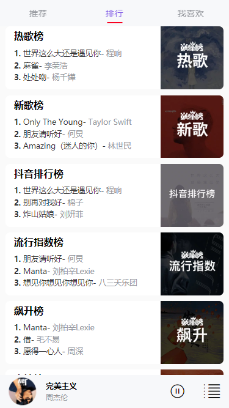

# qqMusic
基于vue+vue-router+axios+better-scroll的音乐项目，用qq音乐接口。
# qqmusic

## 安装依赖并把项目跑起来
```
npm install
npm run serve
```

## 首页截图


## 排行榜截图



## 全屏播放器


## 搜索页面截图


##  待续
项目还在写，后续会更新。。


### Customize configuration
See [Configuration Reference](https://cli.vuejs.org/config/).
